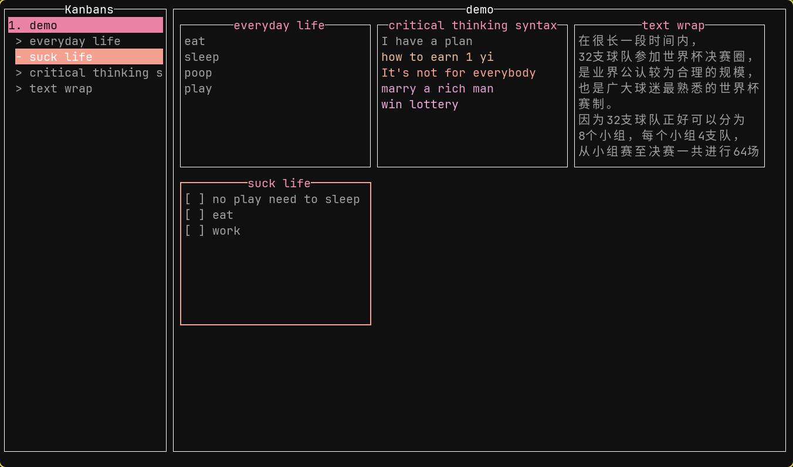

# Hskanban
A feature-rich terminal-based Kanban application for organizing notes and tasks across multiple boards, ideal for capturing ideas and tracking execution.

# Screenshots

[Online demostrate](https://www.bilibili.com/video/BV14SQGYUEep/?vd_source=90d80116a966008a768a9fcfabdc6535)

# Usage
`hskanban mywish.json`
Press F1 anytime you need keyboard shotcut hints.

# Features
- Adaptive waterfall layout
- Note management
- Sidebar navigation
- Kanban board editing
- Multi-file reading
- Text wrapping
- Scrollable mini-windows
- Four-direction navigation
- Custom syntax highlighting
- Nested list folding and editing

# Build
```
ghcup set ghc 9.2.7
cabal build
```
# Special Thanks
Inspired by [ullekha](https://github.com/ajithnn/ullekha)